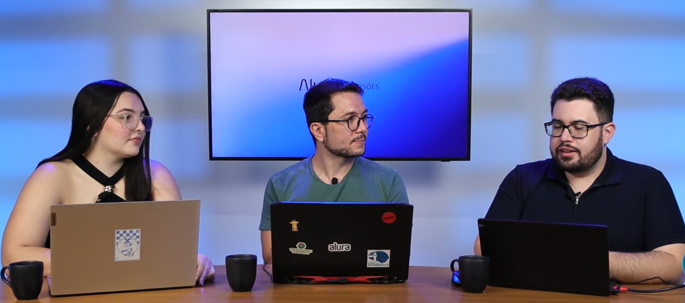

# imersao-alura-eng-de-dados

> **Como usar todos os serviços do Databricks na Free Edition, passo a passo:**
> [docs/servicos-free-edition.md](docs/servicos-free-edition.md) — do cadastro gratuito à publicação no GitHub.
> Mapas também cada aula ao serviço usado e à pasta correspondente deste repositório.

> **Comece por aqui:** [docs/comece-aqui.md](docs/comece-aqui.md) — o percurso pelo navegador, do download dos CSVs à primeira consulta, sem instalar nada.

## Sumário

- [Como usar — resumo passo a passo (Databricks Free Edition)](#como-usar--resumo-passo-a-passo-databricks-free-edition)
- [Masterclass](#masterclass)
- [Aula 01 — Abertura](#aula-01--abertura)
- [Aula 02 — Domine a Ingestão de Dados Brutos](#aula-02--domine-a-ingestão-de-dados-brutos)
- [Aula 03 — Transforme Dados em Bases Confiáveis](#aula-03--transforme-dados-em-bases-confiáveis)
- [Aula 04 — Crie seu Agente de IA no Databricks](#aula-04--crie-seu-agente-de-ia-no-databricks)
- [Aula 05 — Publique seu pipeline e desbrave sua Carreira em Dados com IA](#aula-05--publique-seu-pipeline-e-desbrave-sua-carreira-em-dados-com-ia)
- [Estrutura do repositório](#estrutura-do-repositório)

## Como usar — resumo passo a passo (Databricks Free Edition)

O caminho completo, dos arquivos crus ao agente de IA, usa todos os serviços
gratuitos do Databricks nesta ordem:

1. **Workspace + Compute serverless** — conta Free Edition e execução sem cluster.
2. **Unity Catalog** — catálogo `voebem` com schemas `bronze`/`silver`/`gold` e volume `arquivos`.
3. **Volumes** — envio dos 15 CSVs da ANAC.
4. **Notebooks** — ingestão Bronze, transformação Silver e governança Gold.
5. **SQL Editor** — consultas sobre `voebem.gold.*` (gabarito em `sql/gabarito/`).
6. **Spark Declarative Pipelines** — qualidade dos dados: marca, audita e quarentena.
7. **Jobs** — orquestração e agendamento dos notebooks e pipelines.
8. **Genie Code** — IA assistiva dentro do notebook.
9. **Genie Space** — agente que responde em linguagem natural sobre a tabela OBT.
10. **Git + GitHub** — publicação e divulgação do projeto.

> Guia completo de cada serviço (incluindo os limites da Free Edition):
> [docs/servicos-free-edition.md](docs/servicos-free-edition.md).

## Masterclass

* Introdução

Boas-vindas à Masterclass da Imersão de Engenharia de Dados! Se você quer entender como os dados são coletados, tratados, transformados e preparados para serem utilizados por diferentes áreas de uma empresa, essa aula é para você.

Nesta Masterclass, vamos partir de um cenário prático de e-commerce para acompanhar a jornada dos dados desde o registro das interações dos usuários até o momento em que essas informações estão prontas para serem consultadas e utilizadas por outros times. De forma simples e prática, você vai:

- Entender o papel da Engenharia de Dados e sua importância dentro de uma empresa
- Conhecer o Databricks e explorar seu ambiente para trabalhar com dados na nuvem
- Aprender os primeiros passos com Python e Pandas para carregar, visualizar, analisar e manipular uma base de dados
- Identificar e tratar valores nulos e dados faltantes, deixando as informações mais organizadas e estruturadas
- Conhecer o uso de SQL para realizar consultas, filtros e agregações diretamente sobre os dados
- Compreender quando utilizar Python, SQL e Spark de acordo com o tipo e o volume da tarefa
- Explorar conceitos importantes da área, como ingestão, transformação, armazenamento, processamento distribuído, orquestração e governança de dados
- Entender como os dados tratados podem ser disponibilizados para outros times, como BI e Ciência de Dados

Ao final desta aula, você terá uma visão mais clara sobre o trabalho de um engenheiro de dados, conhecerá algumas das principais ferramentas utilizadas no dia a dia da área e estará preparado para aprofundar esses conhecimentos ao longo da Imersão.

Prepare-se para colocar a mão na massa, explorar seus primeiros dados e dar os primeiros passos na sua jornada em Engenharia de Dados. Aproveite a aula!

**Links úteis:** Databricks · Base de dados csv

## Aula 01 — Abertura

**Links importantes:** Databricks: o que é e para que serve?

Para gerenciar e processar seus dados em larga escala, as equipes de dados muitas vezes precisavam trabalhar com várias ferramentas diferentes. Essas ferramentas eram complexas e difíceis de usar, exigindo habilidades avançadas de programação e conhecimento profundo de bancos de dados e tecnologias de armazenamento.

Surge então a plataforma do Databricks como uma solução de computação em nuvem que pode ser usada para processamento, transformação e exploração de grandes volumes de dados. Ela foi projetada para permitir que os usuários se concentrem em análises de dados avançadas e na tomada de decisões baseadas em dados, de uma forma mais simples.

A plataforma é altamente escalável e pode ser configurada para trabalhar com vários serviços em nuvem, incluindo Amazon Web Services (AWS), Microsoft Azure e Google Cloud Platform.

## Aula 02 — Domine a Ingestão de Dados Brutos

* Introdução

Chegou a hora de mergulhar no ecossistema de Engenharia de Dados com o Databricks. Você vai entender como estruturar um projeto do zero, desde a configuração do ambiente até a criação de um pipelines de dados, utilizando Spark e Inteligência Artificial para transformar dados brutos em insights estratégicos.

APROVEITE PARA ASSISTIR AGORA, A AULA ESTÁ DISPONÍVEL POR POUCOS DIAS!

**Nesta aula, você vai:**

- Entender a arquitetura medalhão (Bronze, Silver e Gold) e sua importância na governança de dados.
- Descobrir como utilizar o Genie (IA do Databricks) para acelerar o desenvolvimento de códigos e análises.
- Configurar catálogos, esquemas e volumes para organizar o seu Data Lake.
- Iniciar o projeto prático da VoeBem Analytics com dados reais da ANAC.
- Compreender os conceitos de Lakehouse, Delta Lake e a orquestração de pipelines automatizados.
- Implementar a camada Bronze da Arquitetura Medalhão, compreendendo seu papel na ingestão e organização dos dados em um pipeline.

**Links importantes:** Databricks · Base de Voos · Arquivos do Dataset

## Aula 03 — Transforme Dados em Bases Confiáveis

* Introdução

Na terceira aula, damos continuidade ao nosso projeto de Engenharia de Dados avançando para a camada Silver da Arquitetura Medalhão. Você vai aprender a transformar e qualificar os dados brutos, aplicando tipagem, tratamentos, padronizações e metadados que tornam as informações mais consistentes e preparadas para consumo.

APROVEITE PARA ASSISTIR AGORA, A AULA ESTÁ DISPONÍVEL POR POUCOS DIAS!

**Nesta aula, você vai:**

- Entender o papel da camada Silver na governança, qualidade e padronização dos dados.
- Aprender a tipar colunas, tratar valores nulos e calcular métricas derivadas, como o atraso real dos voos.
- Descobrir como unificar tabelas de diferentes fontes em uma única visão consolidada.
- Adicionar metadados de governança (data de carga, usuário e versão do pipeline) para rastreabilidade e auditoria.
- Conhecer a orquestração de pipelines via Jobs do Databricks e a governança com Unity Catalog.

## Aula 04 — Crie seu Agente de IA no Databricks

* Introdução

Nesta aula, damos continuidade ao projeto explorando um dos pontos mais críticos da Engenharia de Dados: a qualidade dos dados na camada Silver. Você vai aprender a usar o Genie Code para identificar problemas de qualidade, construir um pipeline de validação com o Spark Declarative Pipelines e, por fim, avançar para a camada Gold, modelando uma tabela analítica pronta para consumo de negócio e de agentes de IA.

APROVEITE PARA ASSISTIR AGORA, A AULA ESTÁ DISPONÍVEL POR POUCOS DIAS!

**Nesta aula, você vai:**

- Utilizar o Genie Code como especialista em governança para identificar tratamentos de qualidade nos dados da Silver.
- Construir um processo de Data Quality que impede o carregamento de dados inválidos, como códigos ICAO vazios.
- Conhecer o Spark Declarative Pipelines e suas três etapas: dados marcados, auditados e em quarentena.
- Aplicar constraints e expectations em SQL para validar regras de negócio automaticamente.
- Modelar a camada Gold utilizando o conceito de One Big Table (OBT), unindo fatos e dimensões em uma única tabela.
- Explorar rastreabilidade e linhagem de dados através do Unity Catalog, incluindo o registro de eventos de qualidade.

## Aula 05 — Publique seu pipeline e desbrave sua Carreira em Dados com IA

* Encerramento

**Links importantes para você acompanhar a imersão**

- Acesse o Guia de Mergulho
- Participe do canal do Whatsapp e fique por dentro de todas as novidades: Acesse aqui

**Aprofunde-se nos seguintes tópicos:**

- Storytelling com dados: transforme seus dados em narrativas envolventes
- Transformando dados em insights: como criar um relatório baseado em análises de dados

**Divulgue seu projeto**

Quem compartilha seus projetos ganha mais visibilidade no mercado. Poste seu progresso no LinkedIn e use a hashtag: #EngenhariadeDados

Assim você pode trocar experiências com outros participantes e até chamar a atenção de recrutadores.

**Links importantes:** Databricks · Base de Voos · Arquivos do Dataset · Códigos da Imersão

## Estrutura do repositório

| Pasta | Conteúdo |
|---|---|
| `dados/` | 15 CSVs da ANAC: 12 meses de VRA (ago/2025 a jul/2026) e 3 cadastros de referência |
| `notebooks/` | Ingestão Bronze, transformação Silver e governança Gold (formato Databricks) |
| `pipelines/qualidade/` | Regras de qualidade e quarentena para diagnóstico |
| `sql/gold/` | Dimensão de aeroportos, fato de voos e tabela de consumo (OBT) |
| `sql/gabarito/` | Consultas das 5 perguntas de negócio (P1..P5b) |
| `scripts/` | Download dos dados e utilitários opcionais de execução e Genie |
| `genie/` | Instruções da camada semântica e configuração de exemplo do Genie Space |
| `docs/` | Fontes, perguntas de negócio, teste de aceitação e guias (inclui a imagem do fluxo) |